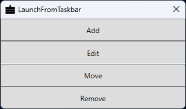
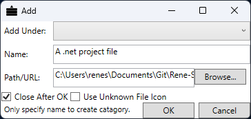
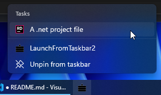

# LaunchFromTaskbar

This is an application I found that I created around 2010 when I still wrote in Visual Basic.NET. But it's actually quite useful. Just updated .NET from 4.0 to 4.8 and it compiled and runs just fine on Windows 11 :)

It allows you to create taskbar jumplist items to quickly open things from your taskbar.

  
  

